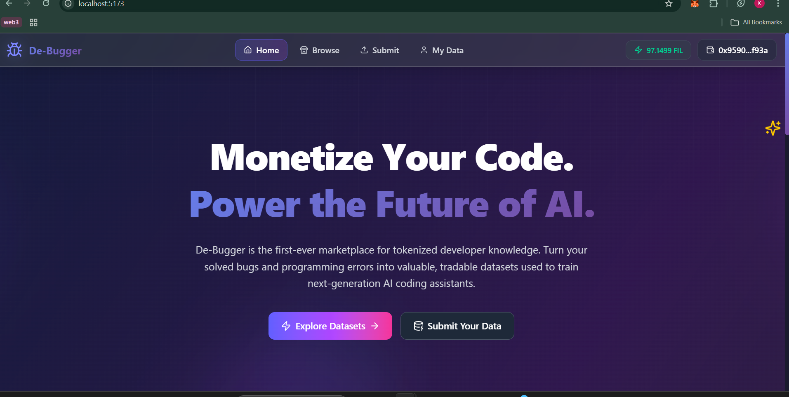

# 🐞 De-Bugger: The Marketplace for Developer Knowledge  

> **Turn debugging wins into datasets that power smarter AI.**

---

## 🌐 Live Demo  
👉 [De-Bugger on Vercel](https://errdapp-i2tf.vercel.app/)  

---

## 📖 The Story Behind Every Error  
Every developer knows the pain of chasing bugs for hours, only to discover a missing semicolon or subtle memory leak. That moment of triumph brings unique, valuable knowledge—but it usually disappears.  

**What if debugging knowledge could be turned into an asset?**

---

## 💡 What is De-Bugger?  
**De-Bugger** is the world’s first **decentralized marketplace** where developers can transform their debugging solutions into tradable datasets. Each fix becomes permanent, verifiable, and monetizable data to train the next generation of AI coding assistants.  

---

## 📸 Screenshots  

### 🏠 Homepage  
  

### 📂 Dataset Submission  
  

### 🛒 Marketplace  
  

### 🔑 Access NFT & Download  
  

*(Save your screenshots in a `/screenshots` folder inside the repo and update these file paths.)*  

---

## ⚙️ How It Works  

### 👨‍💻 For Developers  
- **Effortless Submission:** Upload code snippet, logs, and fix.  
- **AI-Powered Curation:** Titles, summaries, and tags are auto-generated.  
- **Access NFTs:** Buyers unlock datasets through ERC-1155 NFTs.  

### 🛒 For Buyers  
- **Discover:** Browse datasets by language, platform, or error type.  
- **Preview:** Interact with an AI agent (RAG) to query datasets.  
- **Purchase & Access:** Pay in `tFIL` → receive an Access NFT → download encrypted dataset from Filecoin.  

---

## 🏗️ Tech Stack  

### **Frontend (React + Vite)**  
- React.js + Vite for a fast SPA.  
- Tailwind CSS for styling.  
- `ethers.js` + custom `Web3Context` for wallet & network switching.  

### **Backend (Node.js + Express)**  
- REST API with Express.js.  
- `multer` for file uploads.  
- Acts as a **relayer** for Filecoin events (mints NFTs, updates metadata, runs AI analysis).  

### **Smart Contracts (Solidity on Filecoin)**  
- `Marketplace.sol`: Manages listings, pricing, and purchases.  
- `DatasetNFT.sol`: ERC-1155 contract for dataset access keys.  

### **Partner Technologies**  
- **Lighthouse SDK:** Encrypts & stores datasets permanently on Filecoin.  
- **Akave O3:** S3-compatible decentralized storage for public metadata.  
- **Groq SDK:** AI analysis for titles, summaries, tags, and scoring.  

---

## 🛠️ Hacky but Notable  
We built a **backend relayer pattern**:  
- Node.js backend listens to Filecoin contract events.  
- Automatically triggers actions like minting NFTs, updating metadata, and AI-powered curation.  
- Avoids the complexity of an on-chain bridge while keeping the system simple & hackathon-ready.  

---

## 🚀 Why It Matters  
De-Bugger turns debugging from a **private struggle** into a **global knowledge economy**:  
- Developers earn from their fixes.  
- AI companies get high-quality, real-world training data.  
- The community profits from shared insight.  

👉 **In short: De-Bugger is the stock market for code.**  

---

## 🔮 Roadmap  
- Community dataset validation & curation.  
- On-chain revenue sharing.  
- Advanced marketplace filters.  
- Auto-fix suggestions via deeper AI integration.  

---

## 🛠️ Setup & Installation  

### Prerequisites  
- Node.js (v18+)  
- npm / yarn / pnpm  
- MetaMask (connected to Filecoin Calibration)  

### Clone & Install  
```bash
git clone https://github.com/<your-org>/de-bugger.git
cd de-bugger
npm install

## 📬 Contact Us  

Have questions, feedback, or want to collaborate? Reach out to us!  

### 👤 Ketan Dayke  
- 📧 Email: [ketandayke@gmail.com](mailto:ketandayke@gmail.com)  
- 🐦 Twitter:  [@kd2005KD](https://twitter.com/kd2005KD)  
- 💬 Telegram: [@kd01hu](https://t.me/kd01hu)  

### 👤 Rahul Soni  
- 📧 Email: [sonirahul2764@gmail.com](mailto:sonirahul2764@gmail.com)  
- 🐦 Twitter: [@RahulS764](https://twitter.com/RahulS764)
- 💬 Telegram: [@RahulS764](https://t.me/rahul_soniii)  
